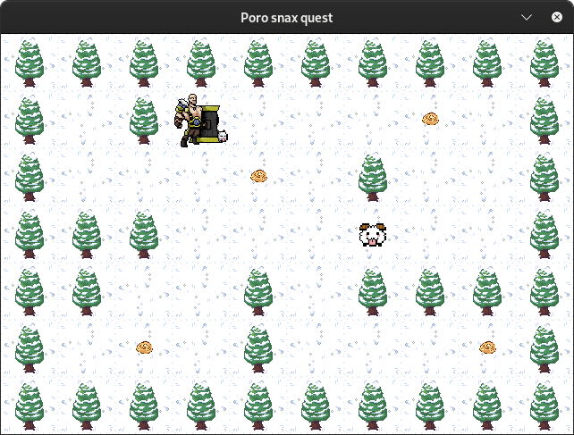
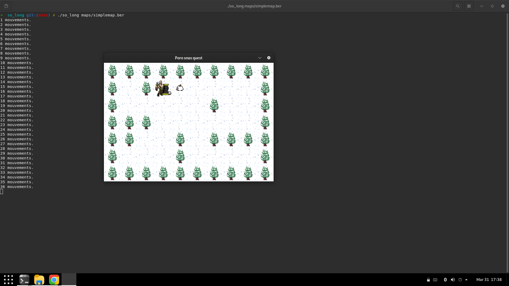

# Project name : so_long

For this project, the assignment is : 

Program a very small 2D game. Its purpose is to make you work with textures, sprites, and some other very basic gameplay elements.

It helps us improving our skills in the following areas: window management, event handling, colors, textures, and so forth.
Made with the school graphical library: the MiniLibX (developed internally and includes basic necessary tools to open a window, create images and deal with keyboard and mouse events.)

We must create our own maps in .ber format and we can create our own sprites in .xpm format.

Controls for movement and rotation are:

<code>W</code>: move forward 
<code>S</code>: move backward 
<code>A</code>: strafe left 
<code>D</code>: strafe right 
<code>←</code>: rotate left 
<code>→</code>: rotate right 

## Usage

In order to compile :
<code>make</code>

Execution :
<code>./so_long maps/simplemap.ber</code>

## Screenshots

